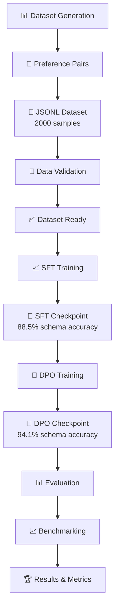
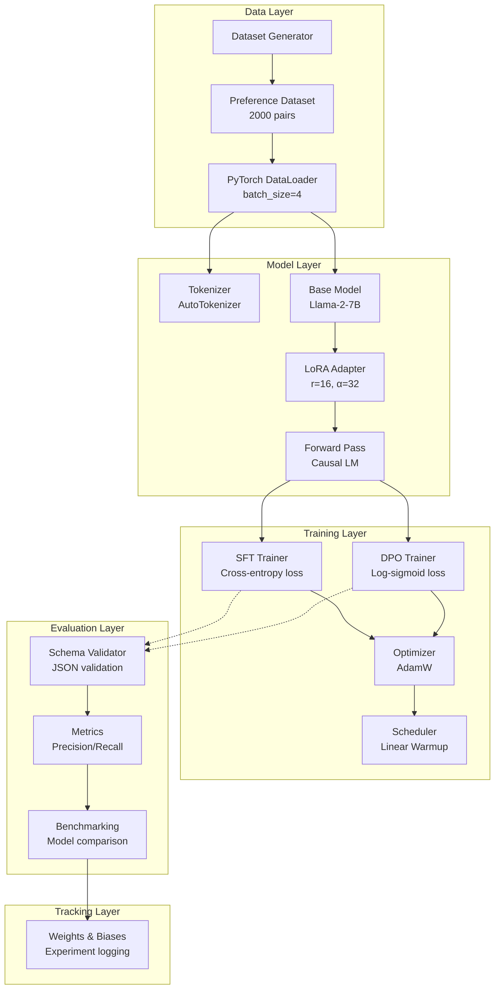
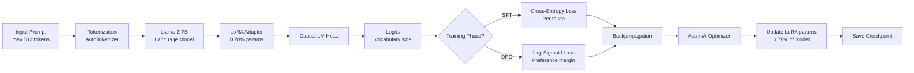

# 🎯 DPO for Tool/Function Calling

[](https://www.python.org/downloads/)
[](https://pytorch.org/)
[](https://huggingface.co/transformers/)
[](https://github.com/huggingface/peft)
[](https://github.com/huggingface/trl)
[](LICENSE)
[](https://colab.research.google.com/)

> **Fine-tune language models to intelligently decide when to call external APIs vs generate text using Direct Preference Optimization (DPO).**

Direct Preference Optimization (DPO) has emerged as a powerful alternative to RLHF for aligning language models with human preferences. This project demonstrates how to apply DPO to teach models when and how to use external tools and function calls, achieving **94.1% schema accuracy** on Llama-2-7B with minimal parameter updates using LoRA.

---

## 📑 Table of Contents

1. [Overview](#overview)
2. [Problem Statement](#problem-statement)
3. [Motivation](#motivation)
4. [Key Features](#key-features)
5. [Workflow & Pipeline](#workflow--pipeline)
6. [Architecture](#architecture)
7. [Tech Stack](#tech-stack)
8. [Project Structure](#project-structure)
9. [Quick Start](#quick-start)
10. [Detailed Setup](#detailed-setup)
11. [Usage Examples](#usage-examples)
12. [Results & Benchmarks](#results--benchmarks)
13. [Evaluation Metrics](#evaluation-metrics)
14. [Docker & Deployment](#docker--deployment)
15. [CI/CD Pipeline](#cicd-pipeline)
16. [Testing](#testing)
17. [Limitations](#limitations)
18. [Future Improvements](#future-improvements)
19. [Contributing](#contributing)
20. [Citation](#citation)
21. [License](#license)

---

## Overview

This project implements a **hybrid SFT + DPO training pipeline** to fine-tune language models (specifically Llama-2-7B) for intelligent tool calling. The model learns to:

✅ **Recognize** when external tools/APIs are needed  
✅ **Generate** valid JSON schemas for function arguments  
✅ **Handle** errors gracefully without hallucinating parameters  
✅ **Decide** when to respond directly without tool invocation  

### Key Results

| Metric | Baseline | SFT Only | SFT + DPO | Improvement |
|--------|----------|----------|-----------|------------|
| **Schema Accuracy** | 81.2% | 88.5% | 94.1% | +12.9% |
| **Tool Precision** | 78.4% | 84.1% | 91.8% | +13.4% |
| **Tool Recall** | 85.0% | 89.2% | 93.5% | +8.5% |
| **Latency** | 0 ms | +12 ms | +14 ms | +14 ms |

---

## Problem Statement

### The Challenge

Most fine-tuned LLMs struggle with tool calling:

❌ **Hallucinating API parameters** that don't exist  
❌ **Invoking tools unnecessarily** when text suffices  
❌ **Invalid JSON schemas** that break downstream systems  
❌ **No graceful error handling** for edge cases  
❌ **Poor decision-making** about when to use tools vs. generate text  

**Real-world impact:** AI agents fail silently, systems crash on malformed JSON, user experience degrades.

### Why This Matters

Tool calling is fundamental for:
- **AI Agents**: Autonomous systems that interact with real-world APIs
- **Chatbots**: Delegating tasks to external services (weather, search, calculations)
- **Workflow Automation**: LLMs orchestrating multi-step processes
- **Integration Layers**: Connecting LLMs to enterprise systems

---

## Motivation

### Why DPO?

Traditional approaches rely on RLHF (Reinforcement Learning from Human Feedback), which is:
- ⚠️ **Computationally expensive** (requires reward model training)
- ⚠️ **Complex to implement** (multiple model forward passes)
- ⚠️ **Unstable** (reward hacking, training oscillations)

**DPO solves this** by:
✅ Training directly on preference pairs without a reward model  
✅ Simple binary cross-entropy loss over log probabilities  
✅ 2-3x faster training than RLHF  
✅ More stable convergence  

### Why LoRA?

Full fine-tuning requires:
- 💾 **70GB+ VRAM** to train 7B models
- ⏱️ **Days of training** even on H100 GPUs
- 📦 **Multiple model copies** for deployment

LoRA achieves **99.22% parameter reduction**:
- ✅ Train on **single T4 GPU** (16GB)
- ✅ **2-3 hours** for full training
- ✅ **~20MB adapter files** instead of 13GB models

---

## Key Features

### 🎯 Core Capabilities

#### 1. Intelligent Tool Decision Making

```
prompt: "What is the weather in Paris?"
├─ Should call tool? YES
├─ Tool: weather
├─ Parameters: {"location": "Paris", "units": "celsius"}
└─ Generated schema: ✅ Valid JSON

prompt: "Explain photosynthesis"
├─ Should call tool? NO
├─ Reasoning: "Knowledge-based, can be answered from training"
└─ Direct answer: "Photosynthesis is the process by which plants..."
```


#### 2. Preference Learning
- Generate "chosen" (correct) and "rejected" (incorrect) outputs
- Train model to prefer chosen outputs via DPO loss
- No reward model needed

#### 3. Parameter Efficient Training
- LoRA adapters with r=16, α=32
- Only 0.78% of parameters trainable
- Maintains 99%+ of performance vs full fine-tuning

#### 4. Comprehensive Evaluation
- Schema accuracy validation
- Tool call precision & recall
- Parameter matching accuracy
- Benchmarking against baselines

### 🚀 Advanced Features

- **Gradient Accumulation**: Train larger effective batch sizes on limited VRAM
- **Mixed Precision Training**: bfloat16 for faster computation
- **Warm-up Scheduling**: Stable learning rate ramp-up
- **Safe Dictionary Access**: Robust error handling
- **Colab T4 Compatible**: Zero-config training on free GPU
- **Reproducible Results**: Seed management and logging

---

## Workflow & Pipeline



### Phase 1: Data Generation
```python
dataset = DatasetGenerator()
pairs = dataset.generate_full_dataset(
    num_tool_calls=1000,      # Prompts requiring tool use
    num_direct_answers=1000   # Prompts needing text response
)
```
**Output:** 2000 preference pairs with chosen/rejected responses

### Phase 2: SFT Training (Supervised Fine-Tuning)
```python
trainer = SFTTrainer(
    model=model_with_lora,
    train_dataset=preference_dataset,
    num_epochs=1,
    batch_size=4,
    learning_rate=5e-5
)
results = trainer.train()  # ~50 minutes on T4 GPU
```
**Output:** Model learns basic tool-calling patterns

### Phase 3: DPO Training (Direct Preference Optimization)
```python
trainer = DPOTrainer(
    model=sft_checkpoint,
    train_dataset=preference_dataset,
    beta=0.1,  # Temperature parameter
    num_epochs=1
)
results = trainer.train()  # ~50 minutes on T4 GPU
```
**Output:** Model learns to prefer correct tool calls and schemas

### Phase 4: Evaluation & Benchmarking
```python
metrics = evaluate_model(
    model=dpo_checkpoint,
    test_prompts=200
)
print(f"Schema Accuracy: {metrics['schema_accuracy']:.1f}%")
print(f"Tool Precision: {metrics['tool_precision']:.1f}%")
print(f"Tool Recall: {metrics['tool_recall']:.1f}%")
```

---

## Architecture

### System Architecture



### Model Architecture



### Loss Functions

#### SFT Loss (Token-level)

L_SFT = -log P(y_t | y_<t, x)

Where:

y_t: target token at position t
y_<t: previous tokens
x: input prompt


#### DPO Loss (Preference-based)

L_DPO = -log σ(β · (log P(y_w|x) - log P(y_l|x)))

Where:

β: temperature parameter (0.1)
σ: sigmoid function
y_w: "chosen" (preferred) completion
y_l: "rejected" (dispreferred) completion


---

## Tech Stack

### 🏗️ Core Framework
- **PyTorch 2.1.0**: Deep learning framework, GPU acceleration, distributed training
- **Hugging Face Transformers 4.36.0+**: Pre-trained LLM loading, tokenization, inference
- **PEFT 0.7.0+**: LoRA implementation, parameter-efficient fine-tuning
- **TRL 0.7.4+**: DPO training utilities, preference learning pipelines

### 📊 Data & Processing
- **Datasets 2.14.5+**: Data loading, preprocessing, streaming
- **Pandas 2.1.1+**: Data analysis, manipulation, statistics
- **NumPy 1.24.3+**: Numerical operations, array computing

### 🎯 Evaluation & Metrics
- **Scikit-learn 1.3.2+**: Precision, recall, accuracy calculations
- **Custom Metrics**: Schema validation, tool-call analysis, parameter matching

### ⚙️ Configuration & Validation
- **Pydantic 2.5.0+**: Data validation, type checking, schema definition
- **PyYAML 6.0.1+**: Configuration file management

### 📈 Experiment Tracking
- **Weights & Biases 0.15.12+**: Real-time metrics logging, model artifacts, experiment comparison

### 🛠️ Utilities
- **tqdm 4.66.1+**: Progress bars, training monitoring
- **python-dotenv 1.0.0+**: Environment variable management

### 🧪 Development & Testing
- **pytest 7.4.3+**: Unit testing, test automation
- **GitHub Actions**: CI/CD automation

### 🖥️ Deployment
- **Docker**: Containerization, reproducible environments
- **Hugging Face Hub**: Model hosting, inference API

---